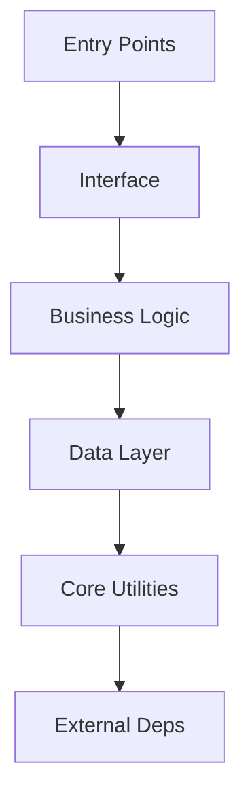

# Bootstrap Project

**Usage**: `/bootstrap-project [target_directory]`

Analyze any codebase and bootstrap a complete Claude context system with parallel agents.

---

## Overview

This command orchestrates **6 parallel agents** to:
1. Analyze codebase architecture
2. Build a layered dependency matrix
3. Generate an architecture diagram
4. Bootstrap the `.claude/` context system
5. Create initial CLAUDE.md with discovered guard rails

**Duration**: 10-20 minutes depending on codebase size

---

## Phase 1: Pre-Flight Checks

### 1.1 Validate Target
```bash
TARGET="${ARGUMENTS:-.}"
[ -d "$TARGET" ] || echo "Error: Directory not found"
```

### 1.2 Check Existing Context
```bash
[ -d "$TARGET/.claude" ] && echo "Warning: .claude/ exists"
```

### 1.3 Estimate Size
```bash
find "$TARGET" -type f \( -name "*.py" -o -name "*.js" -o -name "*.ts" \) | wc -l
```

---

## Phase 2: Parallel Codebase Analysis

Launch ALL agents in a **single message** for true parallelism.

### Agent 1: Dependency Graph Builder
```yaml
Focus:
  - Find all import/require statements
  - Calculate import counts per module
  - Identify root modules (high imports)
  - Identify leaf modules (entry points)
```

### Agent 2: Tech Stack Detector
```yaml
Focus:
  - Languages (primary, secondary)
  - Frameworks (web, ORM, testing)
  - Databases (SQL, NoSQL, cache)
  - Infrastructure (Docker, K8s, cloud)
  - Build tools (package managers, CI/CD)

Files to check:
  - package.json, requirements.txt, go.mod
  - Dockerfile, docker-compose.yml
  - .github/workflows/, README.md
```

### Agent 3: Entry Point Detector
```yaml
Focus:
  - Application entry (main.*, app.*, index.*)
  - CLI entry (cli.py, __main__.py)
  - API entry (routes/*, controllers/*)
  - Worker entry (worker.py, jobs/*)
  - Test entry (test_*, *.test.*)
```

### Agent 4: File Type Classifier
```yaml
Layer 0: Configuration
Layer 1: Core Utilities (helpers, utils)
Layer 2: Data Layer (models, schemas)
Layer 3: Business Logic (services)
Layer 4: Interface (routes, controllers)
Layer 5: Entry Points (main, app)
Supporting: Tests, docs, scripts
```

### Agent 5: Pattern Extractor
```yaml
Focus:
  - Code patterns (auth, db, errors, logging)
  - Naming conventions
  - Architecture patterns (MVC, microservices)
  - Workflow patterns (deploy, test)
```

### Agent 6: Guard Rail Detector
```yaml
Focus:
  - Technical constraints (ports, env vars)
  - Development rules (linting, types)
  - Deployment constraints
  - File organization rules
```

---

## Phase 3: Layer Stack Construction

### Build Matrix

```markdown
## Architecture Layer Stack

### Layer 0: External Dependencies
[Packages from package.json/requirements.txt]

### Layer 1: Core Utilities
[utils/*, helpers/*, lib/*]

### Layer 2: Data Layer
[models/*, schemas/*, entities/*]

### Layer 3: Business Logic
[services/*, domain/*, use_cases/*]

### Layer 4: Interface Layer
[routes/*, controllers/*, handlers/*]

### Layer 5: Entry Points
[main.*, app.*, index.*]
```

### Generate Diagram



---

## Phase 4: Bootstrap .claude/ Structure

### Create Directories
```bash
mkdir -p $TARGET/.claude/{commands,skills,memory/{active,structured},pain-points,specs}
```

### Generate CLAUDE.md
Using Agent 2 (Tech Stack) + Agent 6 (Guard Rails):
- Insert detected tech stack
- Add discovered guard rails
- Link to generated architecture

### Create Memory Files
- quick-reference.md (empty template)
- procedural-memory.md (empty template)

### Create Pain Point Tracking
- active-pain-points.md (empty)
- USAGE_GUIDE.md (template)

---

## Phase 5: Generate Reports

### Architecture Document
Save to `.claude/architecture/layer-stack.md`:
- Full layer matrix
- Mermaid diagram
- File-to-layer mapping

### Bootstrap Report
Save to `.claude/BOOTSTRAP_REPORT.md`:
- Tech stack discovered
- Guard rails created
- Architecture summary
- Next steps

---

## Options

| Option | Effect |
|--------|--------|
| `--quick` | Skip pattern extraction |
| `--dry-run` | Show plan only |
| `--force` | Overwrite existing .claude/ |
| `--no-diagram` | Skip diagram generation |

---

## Examples

```bash
# Bootstrap current directory
/bootstrap-project .

# Bootstrap specific project
/bootstrap-project /path/to/project

# Quick mode
/bootstrap-project --quick .

# Preview only
/bootstrap-project --dry-run /path/to/project
```

---

## Success Criteria

- [ ] All 6 agents completed
- [ ] Layer stack generated
- [ ] CLAUDE.md created with guard rails
- [ ] Memory files initialized
- [ ] Bootstrap report generated

---

*Command Version: 1.0.0*
